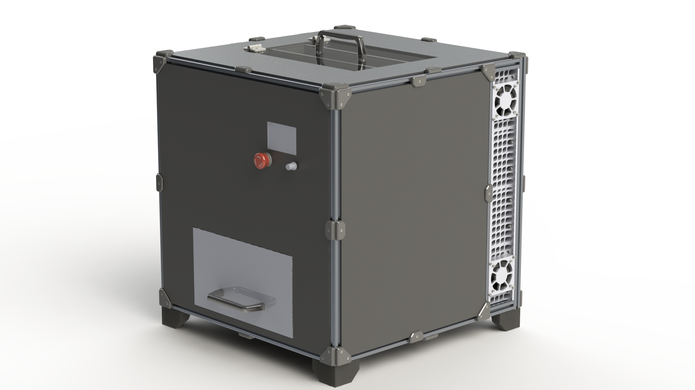

## About
3D printing is a fast-growing manufacturing process stemming from the capability to create parts cheaper than using other manufacturing techniques. However, this growth only adds to the global plastics crisis since the plastics used in 3D printing are not recyclable through municipality curbside programs due to them being a type 7 thermoplastic. The goal of the project is to design a device that will reduce failed prints into a plastic mulch that can be used in standard pellet extruders, turning discarded prints back into useable filament. A Shredder sdesign was selected which works by pelletizing prints using 2 high speed electric planers which shave slices of the prints off, integrated with a shifting mechanism used to separate out usable pallets from waste material. 

## Meet the Team
### Joshua Fernandes
#### Software Lead
Joshua has extensive experience in software design, primarily with embedded systems. He has experience with common microcontrollers such as Arduino and various STM platforms. He also has general knowledge of 3D CAD and circuit design.
### Junsong Li
#### Electrical Lead
Junsong focuses mainly on electrical and supports any manufacturing for the team. He has extensive experience in prototyping for senior electrical engineers. He has also accumulated a lot of hands-on experience in 3D printing, machining, and is proficient in most hand tools.
### Matthew del Rosso
#### Prototyping and Assembly
Matthew has experience in 2D and 3D CAD design developing his skills through working with CAD for all five work terms. He loves to work with his hands and bring his designs into reality and has a large at-home makerspace filled with rapid prototyping tools.
### Terrisa Wang 
#### Mechanical Lead
Terrisa is interested and has experience in 3D CAD and circuit/PCB design through past internships. She has worked with many electrical components specific to the automotive industry and as well as experience in 3D printing and most hand tools and machine tools.
