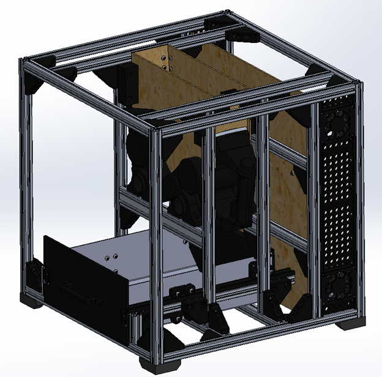

## Progress as of February 10, 2023

The majority of this week was spent designing a collection bin for the shredder. The final design uses a 16GA sheet of aluminum as the floor and 2 sides with 3D printed walls for the front and back walls. Having the 3D printed front and back walls allows us some wiggle room in the event that something is done wrong while bending the sheet metal. The bin rides along 2 rails with a handful of small wheels that allow it to ride smoothly and lock in place when the bin is pushed all the way back. There are 4 wheels on each side of the rail at the front end of the bin to prevent people from pulling upwards on the bin and scraping against the front panel of the shredder.
