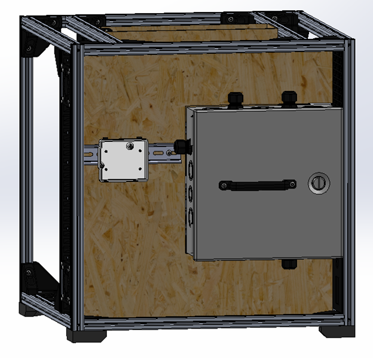

## Progress as of February 3, 2023

After a discussion with one of the course advisors, the design has changed to include a metal enclosure to house all the electronics that are mains powered. This will make getting CSA certification easier as well as allowing us to change the panels from aluminum to HDF which is cheaper and easier to work with. Originally this was left out of the design since the ESTOP is mounted to the front of the machine and is mains powered but now that the electronics enclosure is added we are left with the choice of either moving the estop to the back of the machine so its inside the metal enclosure or we can change the estop to be dc powered. We will need to see which option makes more sense moving forward.

Now that the building has started to wrap up, we are realizing more that we need the M3 tnuts mentioned in the previous post. We found a model on Thingiverse that uses a m3 nut and m4 washer to make a tnut and after testing them they work quite well since all the load is transferred onto the nut and washer instead of the 3D print, so these will be used moving forward.
