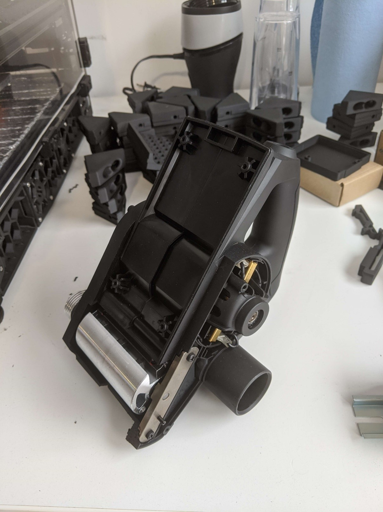

## Progress as of January 25, 2023

Planer bodies have been modified to remove the front portion of the planer. This allows the 2 cutting drums to get much closer which is essential for producing small particles. In the coming weeks a method to fix the planers to the structure needs to be designed, but first the structure needs to be built.
