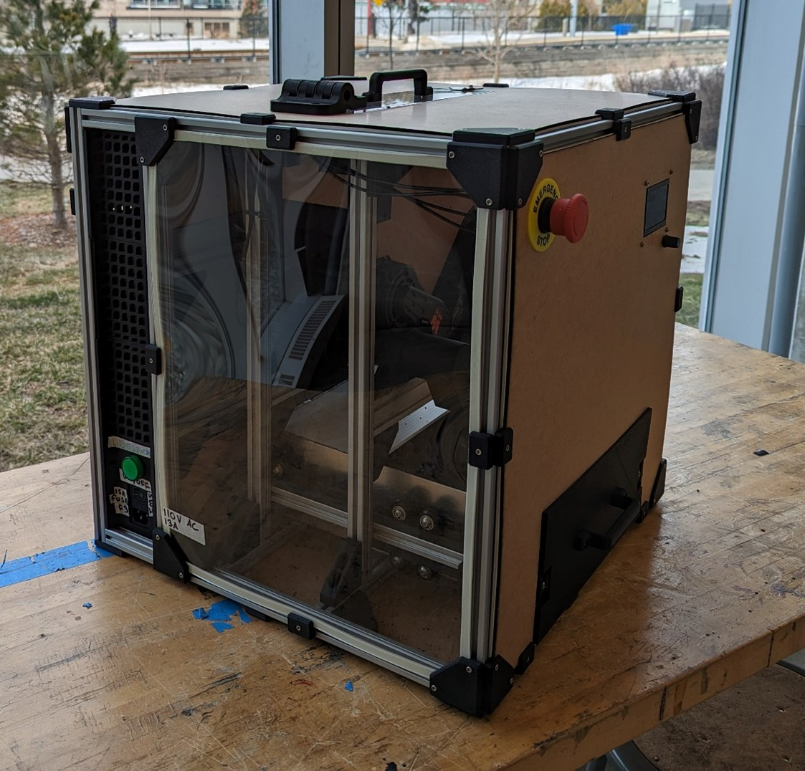

## Progress as of March 17, 2023

Final update before the symposium! All of the problems found in the CSA inspection have been resolved and the system has been tested grinding various parts down to particles. One during our preliminary demo to the course advisors, they had mentioned it would be a good idea to have 2 of the sides made of acrylic so people can see inside what happening which is what prompted the change in the above picture.
