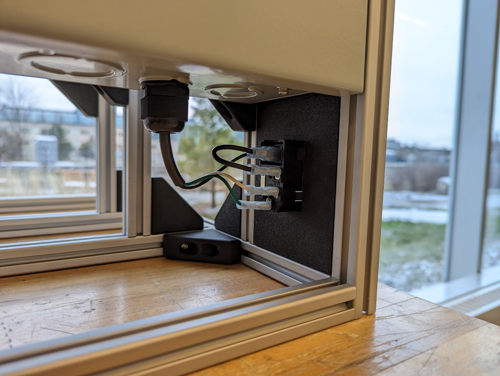

## Progress as of March 7, 2023

Following the CSA meeting there are a couple of issues that need to be resolved for the project to demo on the day of the symposium. First is that the power supply we are currently using to go from 120V to 12V is not CSA approved, so that needs to be swapped out for a new CSA approved power supply unit. The second is that there is a section of mains wiring that is not in the metal enclosure which is shown above. This either needs to be concealed in its own metal box or we need to find another way to run power from the outside of the machine to the inside. The last issue mentioned is that the estop either needs to be converted to DC power, moved into the metal box, or needs its own enclosure at the front of the shredder, which we were expecting.

The power supply is easy to fix, and a new one is already on the way from Digikey. The exposed wiring is going to be enclosed in a metal box of its own which will be made from sheet metal, this allows us to keep the on off switch at the back as well as the removeable plug and power led indicator.

As for the estop, the plan is to switch it to DC wiring. This isn’t an ideal solution since SSRs mainly fail closed and having the estop dc powered will prevent that from happening, but moving the estop to the back negates the purpose of having an estop in an easily accessible place and giving it its own enclosure would require the recutting of the front panel which we want to avoid due to the lead time of laser cutting.
